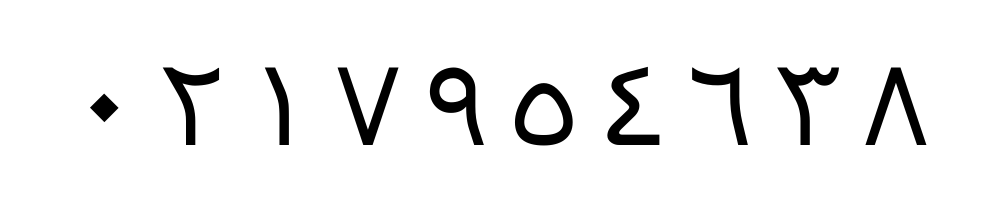

# Designing a system for producing Persian numerals font

In this project, we needed a strong dataset. In the first step, we selected a Persian font. The selected font is located in the repository in the fonts folder, and its name is Tahoma.

 In the next step, 100 photos with the selected font are selected, with numbers inside each. There are 0 to 9, we produced them with different sizes and resolutions and saved them in the output folder, then we read the numbers inside the images with an ocr model called tesseract.

Link to the tesseractOCR module 👇     
https://digi.bib.uni-mannheim.de/tesseract/tesseract-ocr-w64-setup-5.3.3.20231005.exe

We used the tesseract library, and you can use the following instructions to install this library 👇   
pip install pytesseract

In the next step, we put real labels and predicted labels on the read images